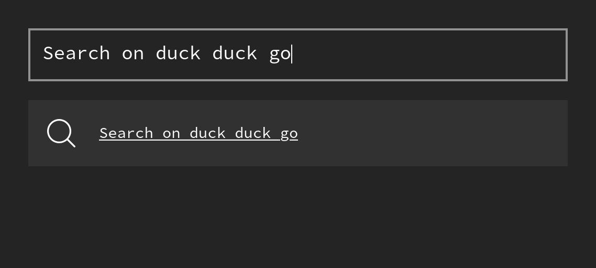
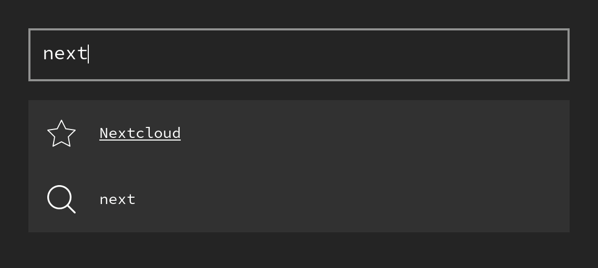
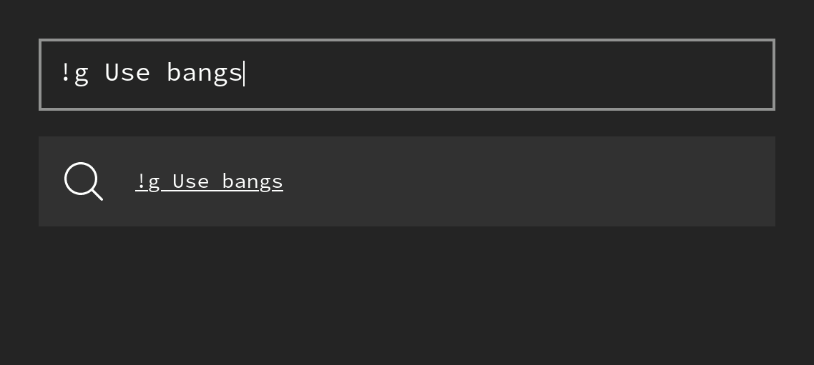

# Startpage

> Minimal, keyboard-driven, customizable start page

## Features

**Search:**



**Favourites:**



**Go directly to a URL:**


**Take advantage of DuckDuckGo's bangs:**



## Setup

1. Clone the repository:
	```
	git clone https://github.com/MarcelRobitaille/startpage
	cd startpage
	```

1. Install node modules:
	```
	npm install
	```

1. Build the static website:
	```
	npm run build
	```

1. Setup nginx:

	I use nginx to serve the static website. My simple configuration can be found [here](./nginx.conf). Save this as `/etc/nginx/sites-available/startpage` and include it in `/etc/nginx/nginx.conf`.

	For the best performance, it's best to run this website locally. It is really annoying if your startpage loads slowly.

1. Set this to your browser's start page:

	I use the [Firefox extension New Tab Override](https://addons.mozilla.org/en-US/firefox/addon/new-tab-override/) for this.

## Testing

This project has tests, even though the coverage is not good.

```
npm test
```
